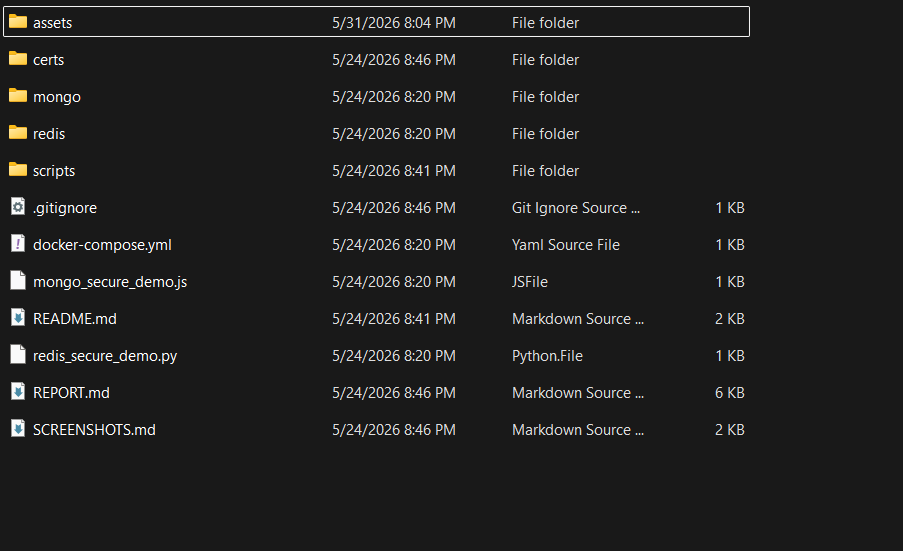
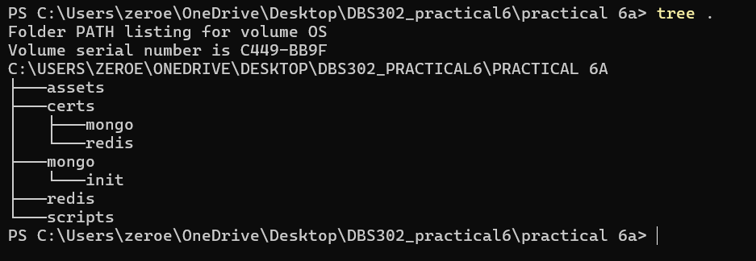
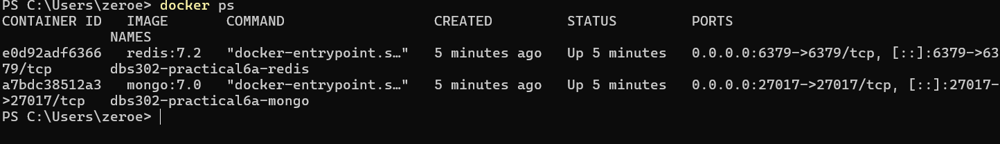
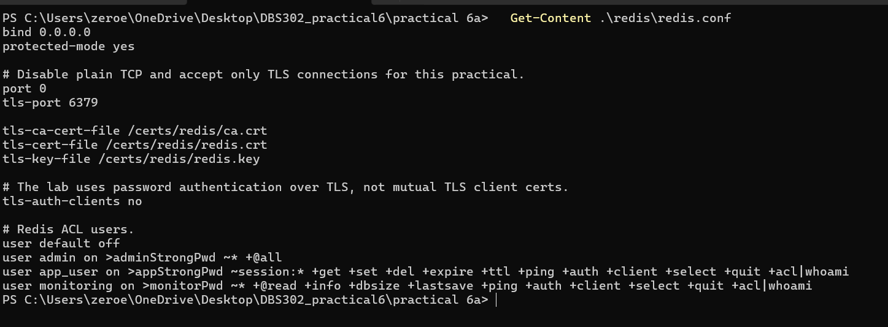
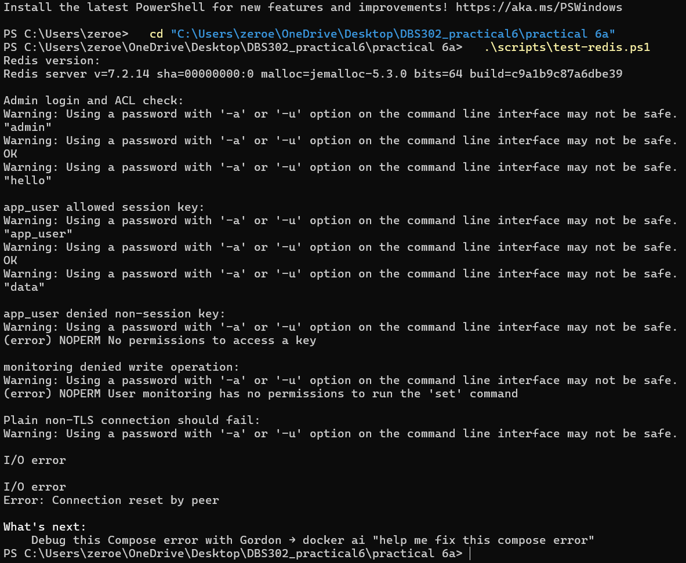
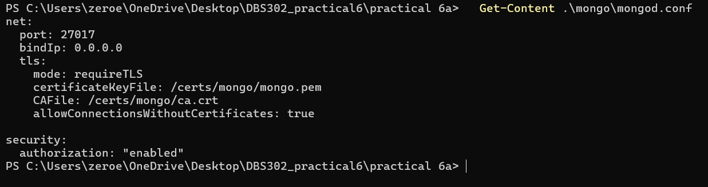
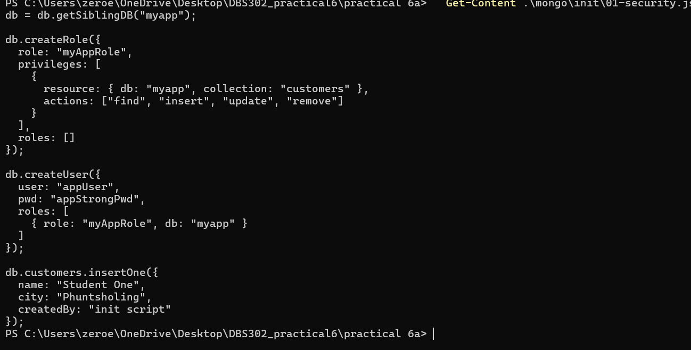
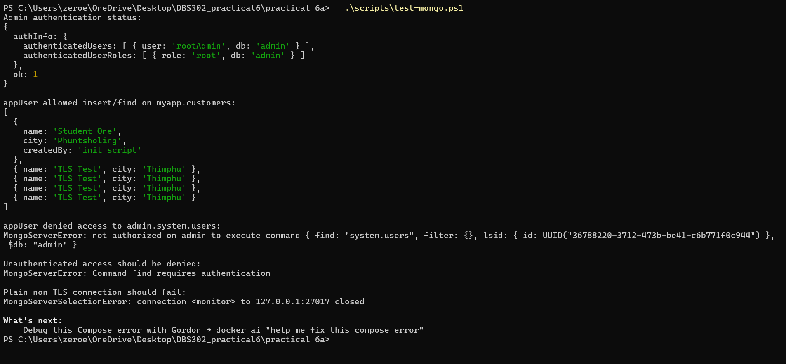

# Practical 6a: Securing Redis and MongoDB

## Aim

To configure and verify authentication, encryption, and role-based access control for Redis and MongoDB, and to perform a basic security audit of the configured databases.

## Objectives

- Enable password-based authentication and ACL in Redis.
- Enable TLS encryption for Redis connections.
- Enable authentication and RBAC in MongoDB.
- Enable TLS for MongoDB so that traffic is encrypted in transit.
- Execute a simple security audit checklist for both databases and record findings.

## Theory

Authentication verifies the identity of a database client before it can access data. In this practical, Redis uses ACL users with passwords, while MongoDB uses database users authenticated against the `admin` and `myapp` databases.

Encryption protects data while it travels across the network. Redis and MongoDB are both configured with TLS using self-signed lab certificates, so clients must connect with TLS options.

Role-Based Access Control limits users to only the actions they need. Redis applies this through ACL command and key-pattern rules. MongoDB applies this through roles and privileges on specific databases and collections.

## Environment

- Redis: Docker image `redis:7.2`
- MongoDB: Docker image `mongo:7.0`
- TLS certificates: self-signed certificates generated by `scripts/generate-certs.sh`
- Working directory: `practical 6a`

### Project Folder Evidence

The practical folder contains the Docker Compose file, Redis and MongoDB configuration folders, scripts, and report file.



The terminal tree output also confirms the main working directory structure.



## Procedure

### Start the Lab

```bash
chmod +x scripts/*.sh
./scripts/generate-certs.sh
docker compose up -d
```

Screenshot: services started successfully.



### Redis Security Configuration

Redis was configured in `redis/redis.conf` with plain TCP disabled and TLS enabled:

```conf
port 0
tls-port 6379
tls-ca-cert-file /certs/redis/ca.crt
tls-cert-file /certs/redis/redis.crt
tls-key-file /certs/redis/redis.key
tls-auth-clients no
```

Redis ACL users:

```conf
user default off
user admin on >adminStrongPwd ~* +@all
user app_user on >appStrongPwd ~session:* +get +set +del +expire +ttl +ping +auth +client +select +quit +acl|whoami
user monitoring on >monitorPwd ~* +@read +info +dbsize +lastsave +ping +auth +client +select +quit +acl|whoami
```

Screenshot: `redis/redis.conf` ACL and TLS lines.



### Redis Audit Commands

```bash
./scripts/test-redis.sh
```

Expected observations:

- Admin user can run `ACL WHOAMI`, `SET`, and `GET`.
- `app_user` can write keys matching `session:*`.
- `app_user` cannot write `otherkey`.
- `monitoring` cannot perform write operations.
- Plain non-TLS Redis connection fails.

Screenshot: Redis allowed and denied command outputs.



### MongoDB Security Configuration

MongoDB was configured in `mongo/mongod.conf`:

```yaml
net:
  port: 27017
  bindIp: 0.0.0.0
  tls:
    mode: requireTLS
    certificateKeyFile: /certs/mongo/mongo.pem
    CAFile: /certs/mongo/ca.crt
    allowConnectionsWithoutCertificates: true

security:
  authorization: "enabled"
```

The app role and user were created in `mongo/init/01-security.js`:

```javascript
db.createRole({
  role: "myAppRole",
  privileges: [
    {
      resource: { db: "myapp", collection: "customers" },
      actions: ["find", "insert", "update", "remove"]
    }
  ],
  roles: []
});
```

Screenshot: MongoDB config and user/role script.





### MongoDB Audit Commands

```bash
./scripts/test-mongo.sh
```

Expected observations:

- `rootAdmin` authenticates successfully.
- `appUser` can insert and read documents in `myapp.customers`.
- `appUser` cannot read `admin.system.users`.
- Unauthenticated access is denied.
- Plain non-TLS MongoDB connection fails.

Screenshot: MongoDB allowed and denied command outputs.



## Observations

| Test | Expected Result | Actual Result |
| --- | --- | --- |
| Redis admin login | Success | Passed: `ACL WHOAMI` returned `admin`; `SET` and `GET` worked. |
| Redis `app_user` writes `session:*` key | Success | Passed: `SET session:user123 data` returned `OK`. |
| Redis `app_user` writes `otherkey` | Denied | Passed: Redis returned `NOPERM No permissions to access a key`. |
| Redis monitoring user writes key | Denied | Passed: Redis returned `NOPERM User monitoring has no permissions to run the 'set' command`. |
| Redis non-TLS connection | Failed | Passed: plain Redis connection returned `I/O error` and `Connection reset by peer`. |
| MongoDB root admin login | Success | Passed: `connectionStatus` showed authenticated user `rootAdmin`. |
| MongoDB `appUser` insert/find | Success | Passed: insert succeeded and customer documents were returned. |
| MongoDB `appUser` reads admin users | Denied | Passed: MongoDB returned `not authorized on admin`. |
| MongoDB unauthenticated access | Denied | Passed: MongoDB returned `Command find requires authentication`. |
| MongoDB non-TLS connection | Failed | Passed: MongoDB returned a server selection/closed connection error. |

## Security Audit Summary

| Area | Status | Evidence |
| --- | --- | --- |
| Redis authentication | Enabled | Default user is disabled; named ACL users require passwords. |
| Redis access control | Enforced | `app_user` is restricted to `session:*`; monitoring user is read-only. |
| Redis TLS | Enabled | Plain port disabled with `port 0`; TLS port `6379` is enabled. |
| MongoDB authentication | Enabled | `security.authorization` is enabled. |
| MongoDB RBAC | Enforced | `appUser` only has privileges on `myapp.customers`. |
| MongoDB TLS | Enabled | `net.tls.mode` is set to `requireTLS`. |
| Remaining weakness | Needs improvement | Lab uses demo passwords, self-signed certificates, and `bindIp: 0.0.0.0`. |

## Screenshot Evidence Summary

| Evidence | Screenshot |
| --- | --- |
| Project folder | `assets/workingtree2.png` |
| Folder tree | `assets/workingtree.png` |
| Containers running | `assets/runningContainers.png` |
| Redis configuration | `assets/redisConf.png` |
| Redis audit | `assets/testRedis.png` |
| MongoDB configuration | `assets/mongoConf.png` |
| MongoDB RBAC setup | `assets/securityjs.png` |
| MongoDB audit | `assets/testMongo.png` |

## Conclusion

This practical demonstrates how Redis and MongoDB can be secured using authentication, encrypted connections, and limited user permissions. Redis ACL rules restrict users by command and key pattern, while MongoDB RBAC restricts users by database, collection, and action. The audit tests confirmed both successful authorized actions and denied unauthorized actions, which is important when validating database security.
